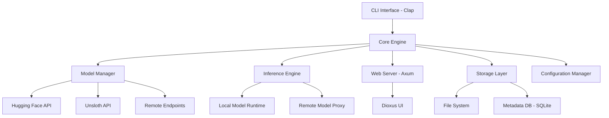
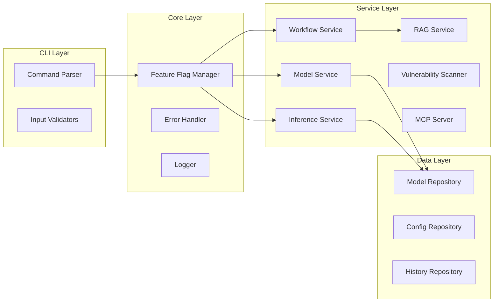
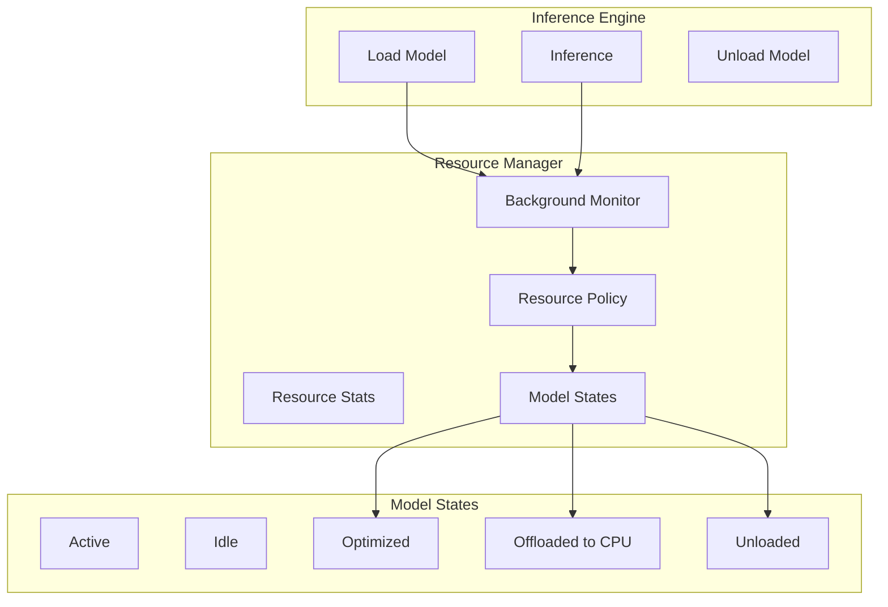

# Design Document

## Overview

Fuse is a comprehensive AI model management platform built in Rust that enables developers to pull, run, manage, and interact with AI models from various sources. The platform provides advanced features including model quantization, layer manipulation, vulnerability scanning, RAG implementation, workflow orchestration, and a chat interface built with Dioxus. The architecture follows a modular design with feature flags for optional capabilities, ensuring security through OWASP Top 10 and CIS benchmark compliance.

### Key Design Principles

1. **Modularity**: Feature-flagged capabilities allow users to enable only what they need
2. **Security-First**: All operations follow OWASP Top 10 and CIS benchmarks
3. **Async-First**: Leveraging Tokio for all I/O operations and concurrent processing
4. **Extensibility**: Plugin architecture for custom model sources and behaviors
5. **Developer Experience**: Intuitive CLI with comprehensive error messages and progress indicators

## Architecture

### High-Level Architecture



### Component Architecture



## Components and Interfaces

### 1. CLI Interface

**Technology**: Clap v3 with derive macros

**Structure**:
```rust
#[derive(Parser)]
struct Cli {
    #[clap(subcommand)]
    command: Commands,
}

#[derive(Subcommand)]
enum Commands {
    Pull(PullArgs),
    Run(RunArgs),
    Rm(RemoveArgs),
    Update(UpdateArgs),
    Quantize(QuantizeArgs),
    Layer(LayerCommand),
    Inspect(InspectArgs),
    Merge(MergeArgs),
    CompCheck(CompatibilityArgs),
    Scan(ScanArgs),
    Remote(RemoteCommand),
    Workflow(WorkflowCommand),
    Ui(UiArgs),
    History(HistoryArgs),
    Features(FeaturesCommand),
    Mcp(McpCommand),
}
```

**Key Features**:
- Consistent command structure across all operations
- Built-in help and validation
- Progress indicators for long-running operations
- Colored output for better readability

### 2. Model Manager

**Responsibilities**:
- Download models from various sources (Hugging Face, Unsloth, remote)
- Manage model storage and metadata
- Handle authentication for private registries
- Version tracking and updates

**Interface**:
```rust
#[async_trait]
trait ModelManager {
    async fn pull(&self, source: ModelSource, name: &str, auth: Option<Auth>) -> Result<Model>;
    async fn remove(&self, name: &str) -> Result<()>;
    async fn update(&self, name: &str) -> Result<UpdateResult>;
    async fn list(&self) -> Result<Vec<ModelInfo>>;
    async fn get_metadata(&self, name: &str) -> Result<ModelMetadata>;
}

struct ModelSource {
    provider: Provider, // HuggingFace, Unsloth, Remote, Local
    repository: String,
    version: Option<String>,
}
```

**Implementation Details**:
- Uses `reqwest` for HTTP operations with retry logic
- Implements streaming downloads with progress tracking
- Stores models in `~/.fuse/models/` directory
- Maintains Redb embedded database for metadata (pure Rust, ACID transactions)

### Storage Layer

**Technology**: Redb (https://github.com/cberner/redb)

**Why Redb**:
- Pure Rust implementation with zero C dependencies
- ACID transactions for data integrity
- Type-safe API with compile-time guarantees
- High performance with optimized B-tree implementation
- Embedded database (no separate server process)
- Perfect for CLI tools requiring reliable local storage

**Table Definitions**:
```rust
// Model metadata table
const MODELS_TABLE: TableDefinition<&str, &[u8]> = TableDefinition::new("models");

// Configuration table
const CONFIG_TABLE: TableDefinition<&str, &[u8]> = TableDefinition::new("config");

// Chat history table
const HISTORY_TABLE: TableDefinition<&str, &[u8]> = TableDefinition::new("history");

// Feedback table
const FEEDBACK_TABLE: TableDefinition<&str, &[u8]> = TableDefinition::new("feedback");
```

### 3. Inference Engine

**Responsibilities**:
- Load and run models locally
- Proxy requests to remote endpoints
- Handle streaming responses
- Manage context windows and token limits

**Interface**:
```rust
#[async_trait]
trait InferenceEngine {
    async fn load_model(&self, name: &str) -> Result<ModelHandle>;
    async fn infer(&self, handle: &ModelHandle, input: InferenceInput) -> Result<InferenceOutput>;
    async fn infer_stream(&self, handle: &ModelHandle, input: InferenceInput) 
        -> Result<impl Stream<Item = Token>>;
    async fn unload_model(&self, handle: ModelHandle) -> Result<()>;
}

struct InferenceInput {
    prompt: String,
    images: Vec<Image>,
    context: Option<Vec<Message>>,
    parameters: InferenceParameters,
}

struct InferenceParameters {
    max_tokens: usize,
    temperature: f32,
    top_p: f32,
    stop_sequences: Vec<String>,
}
```

**Implementation Details**:
- Supports multiple inference backends (llama.cpp, candle, ONNX Runtime)
- Implements connection pooling for remote endpoints
- Uses Tokio channels for streaming responses
- Markdown formatting for all outputs

### 4. Web Server (Axum)

**Responsibilities**:
- Expose REST API for inference
- Serve Dioxus UI
- Handle WebSocket connections for streaming
- Implement rate limiting

**API Endpoints**:
```
POST   /api/v1/infer              - Single inference request
POST   /api/v1/infer/stream       - Streaming inference
GET    /api/v1/models             - List available models
GET    /api/v1/models/:name       - Get model details
POST   /api/v1/models/:name/load  - Load model into memory
DELETE /api/v1/models/:name/unload - Unload model
GET    /api/v1/history            - Get chat history
WS     /api/v1/ws                 - WebSocket for real-time updates
```

**Server Structure**:
```rust
async fn start_server(config: ServerConfig) -> Result<()> {
    let app = Router::new()
        .route("/api/v1/infer", post(handle_infer))
        .route("/api/v1/infer/stream", post(handle_infer_stream))
        .route("/api/v1/models", get(list_models))
        .layer(
            ServiceBuilder::new()
                .layer(TraceLayer::new_for_http())
                .layer(RateLimitLayer::new())
                .layer(CorsLayer::permissive())
        );
    
    axum::Server::bind(&config.addr)
        .serve(app.into_make_service())
        .await?;
    
    Ok(())
}
```

### 5. Dioxus UI

**Responsibilities**:
- Provide interactive chat interface
- Display model thinking/planning stages
- Render markdown responses with syntax highlighting
- Show real-time progress and actions

**Component Structure**:
```rust
fn App(cx: Scope) -> Element {
    let models = use_state(cx, Vec::new);
    let selected_model = use_state(cx, || None);
    let messages = use_state(cx, Vec::new);
    let thinking_state = use_state(cx, || None);
    
    cx.render(rsx! {
        div { class: "app-container",
            ModelSelector { models: models, selected: selected_model }
            ChatWindow { messages: messages, thinking: thinking_state }
            InputArea { on_submit: handle_message }
        }
    })
}
```

**Key Features**:
- Server-sent events for streaming responses
- Progressive markdown rendering
- Thinking visualization (when feature flag enabled)
- Code syntax highlighting with `syntect`
- Responsive design for different screen sizes

### 6. RAG Service

**Responsibilities**:
- Index code repositories
- Generate embeddings for code context
- Retrieve relevant context for queries
- Support multi-model chaining

**Interface**:
```rust
#[async_trait]
trait RAGService {
    async fn index_repository(&self, path: &Path) -> Result<IndexHandle>;
    async fn query(&self, index: &IndexHandle, query: &str, k: usize) -> Result<Vec<Context>>;
    async fn update_index(&self, index: &IndexHandle, changes: Vec<FileChange>) -> Result<()>;
}

struct Context {
    file_path: PathBuf,
    content: String,
    relevance_score: f32,
    line_range: (usize, usize),
}
```

**Implementation Details**:
- Uses `tree-sitter` for code parsing
- Implements vector database with `qdrant` or `milvus`
- Supports incremental indexing with git diff
- Caches embeddings for performance

### 7. Workflow Service

**Responsibilities**:
- Parse fuse.md/CLAUDE.md workflow definitions
- Execute workflow steps with retry logic
- Manage workflow state and history
- Support conditional branching and parallel execution

**Workflow Definition Format**:
```markdown
# Workflow: Fix and Test

## Steps

### 1. Analyze Error
- Read compilation error
- Identify root cause
- Plan fix strategy

### 2. Apply Fix
- Modify source files
- Validate syntax

### 3. Compile
- Run cargo build
- If error, goto step 1 (max 5 iterations)

### 4. Test
- Run cargo test
- If failure, goto step 1 (max 3 iterations)

### 5. Complete
- Generate summary
- Update vibe log
```

**Interface**:
```rust
#[async_trait]
trait WorkflowService {
    async fn parse_workflow(&self, path: &Path) -> Result<Workflow>;
    async fn execute(&self, workflow: &Workflow) -> Result<WorkflowResult>;
    async fn get_state(&self, workflow_id: &str) -> Result<WorkflowState>;
}

struct Workflow {
    steps: Vec<WorkflowStep>,
    max_iterations: usize,
    timeout: Duration,
}

struct WorkflowStep {
    id: String,
    action: Action,
    on_success: Option<String>,
    on_failure: Option<String>,
    retry_policy: RetryPolicy,
}
```

### 8. Vulnerability Scanner

**Responsibilities**:
- Scan models for known vulnerabilities
- Integrate with vulnerability databases (GHSA, MITRE, NIST)
- Generate reports in multiple formats
- Support remote model scanning

**Interface**:
```rust
#[async_trait]
trait VulnerabilityScanner {
    async fn scan_model(&self, model: &Model) -> Result<ScanReport>;
    async fn scan_remote(&self, url: &str) -> Result<ScanReport>;
    async fn generate_report(&self, report: &ScanReport, format: ReportFormat) -> Result<Vec<u8>>;
}

struct ScanReport {
    model_name: String,
    scan_date: DateTime<Utc>,
    vulnerabilities: Vec<Vulnerability>,
    overall_score: f32,
}

struct Vulnerability {
    id: String,
    severity: Severity,
    description: String,
    affected_components: Vec<String>,
    remediation: Option<String>,
    references: Vec<String>,
}

enum ReportFormat {
    Html,
    Json,
    CycloneDX,
}
```

**Implementation Details**:
- Integrates with Trivy for scanning capabilities
- Maintains local vulnerability database cache
- Supports custom vulnerability rules
- Generates HTML reports with charts using `plotters`

### 9. MCP Server

**Responsibilities**:
- Implement Model Context Protocol server
- Expose Fuse capabilities as MCP tools
- Handle MCP client connections
- Manage protocol message serialization

**Interface**:
```rust
#[async_trait]
trait MCPServer {
    async fn start(&self, config: MCPConfig) -> Result<()>;
    async fn register_tool(&self, tool: MCPTool) -> Result<()>;
    async fn handle_request(&self, request: MCPRequest) -> Result<MCPResponse>;
}

struct MCPTool {
    name: String,
    description: String,
    parameters: serde_json::Value,
    handler: Box<dyn Fn(serde_json::Value) -> BoxFuture<'static, Result<serde_json::Value>>>,
}
```

**Exposed MCP Tools**:
- `fuse_pull_model` - Pull a model
- `fuse_run_inference` - Run inference
- `fuse_scan_model` - Scan for vulnerabilities
- `fuse_inspect_model` - Inspect model architecture
- `fuse_merge_models` - Merge models
- `fuse_quantize_model` - Quantize a model

### 10. Layer Manipulation Service

**Responsibilities**:
- Inspect model layers
- Add/remove layers
- Implement guardrails
- Validate model integrity after modifications

**Interface**:
```rust
trait LayerService {
    fn inspect_layers(&self, model: &Model, verbose: bool) -> Result<Vec<LayerInfo>>;
    fn remove_layer(&self, model: &mut Model, layer_id: &str) -> Result<()>;
    fn add_layer(&self, model: &mut Model, layer: Layer, position: LayerPosition) -> Result<()>;
    fn validate_model(&self, model: &Model) -> Result<ValidationReport>;
}

struct LayerInfo {
    id: String,
    name: String,
    layer_type: String,
    size_bytes: u64,
    parameter_count: usize,
    tensor_shapes: Vec<TensorShape>,
    metadata: HashMap<String, String>,
}

enum Layer {
    GeoRestriction(GeoRestrictionConfig),
    ContentFilter(ContentFilterConfig),
    Custom(CustomLayerConfig),
}
```

### 11. Quantization Service

**Responsibilities**:
- Support multiple quantization methods
- Validate model compatibility
- Optimize quantized models
- Preserve model metadata

**Interface**:
```rust
#[async_trait]
trait QuantizationService {
    async fn quantize(&self, model: &Model, method: QuantizationMethod) -> Result<Model>;
    fn supported_methods(&self, model: &Model) -> Vec<QuantizationMethod>;
}

enum QuantizationMethod {
    GGUF(GGUFFormat),
    GPTQ(GPTQConfig),
    AWQ(AWQConfig),
    GGML(GGMLFormat),
}

enum GGUFFormat {
    Q4_0,
    Q4_1,
    Q5_0,
    Q5_1,
    Q8_0,
    Q8_1,
}
```

### 12. Compatibility Checker Service

**Responsibilities**:
- Analyze model compatibility for merging
- Calculate compatibility scores
- Generate reports in multiple formats
- Provide merge recommendations

**Interface**:
```rust
trait CompatibilityChecker {
    fn check_compatibility(&self, models: &[Model]) -> Result<CompatibilityReport>;
    fn generate_report(&self, report: &CompatibilityReport, format: ReportFormat, output: Option<PathBuf>) -> Result<PathBuf>;
}

struct CompatibilityReport {
    models: Vec<String>,
    overall_score: f32,
    factors: Vec<CompatibilityFactor>,
    recommendations: Vec<String>,
    merge_strategies: Vec<MergeStrategy>,
    timestamp: DateTime<Utc>,
}

struct CompatibilityFactor {
    name: String,
    score: f32,
    weight: f32,
    details: String,
}

enum ReportFormat {
    AsciiTable,  // Default, printed to stdout
    Json,        // Structured data for programmatic access
    Html,        // Interactive report with charts
    Markdown,    // Formatted text for documentation
}

enum MergeStrategy {
    Average,
    Weighted,
    SLERP,
    Custom(String),
}
```

**Report Generation Details**:

1. **ASCII Table Format** (Default):
   - Displayed directly in terminal
   - Uses `comfy-table` crate for formatting
   - Includes score breakdown and recommendations
   - No file output unless `-o` specified

2. **JSON Format** (`--json`):
   - Structured data with all compatibility metrics
   - Includes raw scores and metadata
   - Saved to `.fuse/report/compatibility/<timestamp>.json` by default
   - Can specify custom path with `-o`

3. **HTML Format** (`--html`):
   - Interactive report with charts using `plotters` or `charming`
   - Includes visualizations of compatibility factors
   - Responsive design with embedded CSS
   - Saved to `.fuse/report/compatibility/<timestamp>.html` by default

4. **Markdown Format** (`--md`):
   - Formatted tables and sections
   - Compatible with GitHub/GitLab rendering
   - Includes code blocks for technical details
   - Saved to `.fuse/report/compatibility/<timestamp>.md` by default

**Report Directory Structure**:
```
.fuse/
└── report/
    ├── compatibility/
    │   ├── 2024-01-15_10-30-45.json
    │   ├── 2024-01-15_10-30-45.html
    │   └── 2024-01-15_10-30-45.md
    ├── scan/
    │   ├── model1_2024-01-15.html
    │   └── model1_2024-01-15.json
    └── inspect/
        └── model1_layers.json
```

### 13. Report Generation System

**Responsibilities**:
- Generate reports in multiple formats (ASCII, JSON, HTML, Markdown)
- Manage report storage in `.fuse/report/` directory
- Handle custom output paths
- Provide consistent formatting across all report types

**Interface**:
```rust
trait ReportGenerator {
    fn generate(&self, data: &dyn ReportData, format: ReportFormat, output: Option<PathBuf>) -> Result<PathBuf>;
}

trait ReportData {
    fn to_ascii_table(&self) -> String;
    fn to_json(&self) -> serde_json::Value;
    fn to_html(&self) -> String;
    fn to_markdown(&self) -> String;
}

enum ReportFormat {
    AsciiTable,  // Printed to stdout, no file unless -o specified
    Json,        // Saved to .fuse/report/<feature>/<name>.json
    Html,        // Saved to .fuse/report/<feature>/<name>.html
    Markdown,    // Saved to .fuse/report/<feature>/<name>.md
}

struct ReportConfig {
    feature_name: String,  // e.g., "compatibility", "scan", "inspect"
    default_filename: String,
    timestamp: DateTime<Utc>,
}
```

**Report Types and Locations**:

| Command | Feature Name | Default Path |
|---------|-------------|--------------|
| `fuse comp check` | `compatibility` | `.fuse/report/compatibility/<timestamp>.<ext>` |
| `fuse scan` | `scan` | `.fuse/report/scan/<model>_<timestamp>.<ext>` |
| `fuse layer inspect` | `inspect` | `.fuse/report/inspect/<model>_layers.<ext>` |
| `fuse inspect` | `inspect` | `.fuse/report/inspect/<model>.<ext>` |

**Common Report Features**:

1. **Timestamp-based naming**: All reports include ISO 8601 timestamps
2. **Automatic directory creation**: Creates `.fuse/report/<feature>/` if not exists
3. **Custom output**: `-o <path>` flag overrides default location
4. **Format detection**: Auto-detects format from file extension if `-o` used without format flag
5. **Consistent styling**: All HTML reports use the same CSS theme
6. **Metadata inclusion**: All reports include generation timestamp, Fuse version, and command used

**HTML Report Template**:
```html
<!DOCTYPE html>
<html>
<head>
    <meta charset="UTF-8">
    <title>Fuse Report - {feature}</title>
    <style>
        /* Embedded CSS for standalone reports */
        body { font-family: 'Inter', sans-serif; margin: 40px; }
        .header { border-bottom: 2px solid #3b82f6; padding-bottom: 20px; }
        .score { font-size: 48px; font-weight: bold; color: #3b82f6; }
        table { width: 100%; border-collapse: collapse; margin: 20px 0; }
        th, td { padding: 12px; text-align: left; border-bottom: 1px solid #ddd; }
        .chart { margin: 30px 0; }
    </style>
</head>
<body>
    <div class="header">
        <h1>{report_title}</h1>
        <p>Generated: {timestamp} | Fuse v{version}</p>
    </div>
    {content}
</body>
</html>
```

**Dependencies for Report Generation**:
- `comfy-table`: ASCII table formatting
- `serde_json`: JSON serialization
- `plotters` or `charming`: Chart generation for HTML reports
- `pulldown-cmark`: Markdown parsing and generation

## Data Models

### Model Metadata

```rust
#[derive(Serialize, Deserialize)]
struct ModelMetadata {
    id: String,
    name: String,
    source: ModelSource,
    version: String,
    downloaded_at: DateTime<Utc>,
    updated_at: Option<DateTime<Utc>>,
    size_bytes: u64,
    architecture: String,
    parameter_count: usize,
    quantization: Option<QuantizationMethod>,
    tags: Vec<String>,
    custom_metadata: HashMap<String, serde_json::Value>,
}
```

### Configuration

```rust
#[derive(Serialize, Deserialize)]
struct FuseConfig {
    models_dir: PathBuf,
    cache_dir: PathBuf,
    log_level: String,
    feature_flags: FeatureFlags,
    server: ServerConfig,
    registries: Vec<RegistryConfig>,
    inference: InferenceConfig,
}

#[derive(Serialize, Deserialize)]
struct FeatureFlags {
    agentic_coding: bool,
    thinking_visualization: bool,
    generative_ui: bool,
    mcp_server: bool,
    vulnerability_scanning: bool,
}

#[derive(Serialize, Deserialize)]
struct ServerConfig {
    host: String,
    port: u16,
    max_connections: usize,
    rate_limit: RateLimitConfig,
    tls: Option<TlsConfig>,
}
```

### Chat History

```rust
#[derive(Serialize, Deserialize)]
struct ChatHistory {
    id: String,
    model_name: String,
    created_at: DateTime<Utc>,
    messages: Vec<Message>,
    feedback: Vec<Feedback>,
}

#[derive(Serialize, Deserialize)]
struct Message {
    role: Role,
    content: String,
    timestamp: DateTime<Utc>,
    metadata: Option<MessageMetadata>,
}

enum Role {
    User,
    Assistant,
    System,
}

#[derive(Serialize, Deserialize)]
struct Feedback {
    message_id: String,
    rating: i8, // -1, 0, 1
    comment: Option<String>,
    timestamp: DateTime<Utc>,
}
```

## Error Handling

### Error Types

```rust
#[derive(Debug, thiserror::Error)]
enum FuseError {
    #[error("Model not found: {0}")]
    ModelNotFound(String),
    
    #[error("Download failed: {0}")]
    DownloadError(String),
    
    #[error("Inference error: {0}")]
    InferenceError(String),
    
    #[error("Authentication failed: {0}")]
    AuthError(String),
    
    #[error("Invalid configuration: {0}")]
    ConfigError(String),
    
    #[error("Workflow execution failed: {0}")]
    WorkflowError(String),
    
    #[error("Feature not enabled: {0}")]
    FeatureDisabled(String),
    
    #[error("IO error: {0}")]
    IoError(#[from] std::io::Error),
    
    #[error("Network error: {0}")]
    NetworkError(#[from] reqwest::Error),
}

type Result<T> = std::result::Result<T, FuseError>;
```

### Error Response Format

```rust
#[derive(Serialize)]
struct ErrorResponse {
    error_code: String,
    message: String,
    details: Option<serde_json::Value>,
    remediation: Option<String>,
    timestamp: DateTime<Utc>,
}
```

### Error Handling Strategy

1. **Graceful Degradation**: Non-critical errors don't crash the application
2. **Detailed Logging**: All errors logged with context and stack traces
3. **User-Friendly Messages**: Technical errors translated to actionable messages
4. **Retry Logic**: Automatic retry for transient failures (network, rate limits)
5. **Rollback Support**: Failed operations can be rolled back to previous state

## Testing Strategy

### Unit Tests

- Test each service independently with mocked dependencies
- Use `mockall` for trait mocking
- Aim for 80%+ code coverage
- Test error paths and edge cases

```rust
#[cfg(test)]
mod tests {
    use super::*;
    use mockall::predicate::*;
    
    #[tokio::test]
    async fn test_pull_model_success() {
        let mut mock_manager = MockModelManager::new();
        mock_manager
            .expect_pull()
            .with(eq(ModelSource::huggingface("gpt2")), eq("gpt2"), eq(None))
            .times(1)
            .returning(|_, _, _| Ok(Model::default()));
        
        let result = mock_manager.pull(ModelSource::huggingface("gpt2"), "gpt2", None).await;
        assert!(result.is_ok());
    }
}
```

### Integration Tests

- Test interactions between components
- Use test containers for external dependencies (SQLite, vector DB)
- Test API endpoints with `axum-test`
- Test workflow execution end-to-end

### Security Tests

- Input validation and sanitization tests
- Authentication and authorization tests
- SQL injection prevention tests
- XSS prevention tests
- Rate limiting tests

### Performance Tests

- Load testing with `criterion`
- Memory leak detection with `valgrind`
- Concurrent request handling tests
- Large model handling tests

## Security Considerations

### OWASP Top 10 Compliance

1. **Injection Prevention**
   - Parameterized queries for database operations
   - Input validation and sanitization
   - Command injection prevention in workflow execution

2. **Broken Authentication**
   - Secure credential storage with encryption
   - Token-based authentication for API
   - Session management with timeout

3. **Sensitive Data Exposure**
   - TLS/SSL for all network communications
   - Encrypted storage for credentials
   - No sensitive data in logs or error messages

4. **XML External Entities (XXE)**
   - Not applicable (no XML parsing)

5. **Broken Access Control**
   - Role-based access control for API endpoints
   - Model access permissions
   - Workflow execution permissions

6. **Security Misconfiguration**
   - Secure defaults in configuration
   - Configuration validation on startup
   - Regular dependency updates

7. **Cross-Site Scripting (XSS)**
   - Content Security Policy headers
   - Output encoding in UI
   - Sanitization of user-generated content

8. **Insecure Deserialization**
   - Safe deserialization with `serde`
   - Type validation
   - Size limits on deserialized data

9. **Using Components with Known Vulnerabilities**
   - Regular `cargo audit` runs
   - Automated dependency updates
   - Vulnerability scanning in CI/CD

10. **Insufficient Logging & Monitoring**
    - Comprehensive logging with `tracing`
    - Audit logs for sensitive operations
    - Monitoring integration support

### CIS Benchmarks

- Secure coding practices
- Regular security audits
- Dependency vulnerability scanning
- Secure configuration management
- Access control and authentication
- Logging and monitoring
- Incident response procedures

## Deployment Architecture

### Directory Structure

```
~/.fuse/
├── config.toml              # Main configuration
├── models/                  # Downloaded models
│   ├── model1/
│   │   ├── model.bin
│   │   └── metadata.json
│   └── model2/
├── cache/                   # Temporary files and cache
├── logs/                    # Application logs
├── fuse.redb                # Redb database (all metadata, history, config)
└── embeddings/              # RAG embeddings

.fuse/                       # Project-specific
├── specs/                   # Spec-driven development
│   ├── fuse.md
│   └── requirements/
└── vibe/                    # Vibe coding logs
    └── session_*.md
```

### Configuration File (config.toml)

```toml
[general]
models_dir = "~/.fuse/models"
cache_dir = "~/.fuse/cache"
log_level = "info"

[feature_flags]
agentic_coding = true
thinking_visualization = false
generative_ui = true
mcp_server = false
vulnerability_scanning = true

[server]
host = "127.0.0.1"
port = 8080
max_connections = 100

[server.rate_limit]
requests_per_minute = 60

[registries]
[[registries.sources]]
name = "huggingface"
url = "https://huggingface.co"
auth_required = false

[[registries.sources]]
name = "unsloth"
url = "https://unsloth.ai"
auth_required = false

[inference]
default_max_tokens = 2048
default_temperature = 0.7
context_window = 4096
```

## Performance Optimizations

1. **Async I/O**: All I/O operations use Tokio for non-blocking execution
2. **Connection Pooling**: Reuse HTTP connections for remote endpoints
3. **Caching**: Cache model metadata, embeddings, and frequently accessed data
4. **Lazy Loading**: Load models on-demand rather than at startup
5. **Streaming**: Stream large responses to reduce memory usage
6. **Parallel Processing**: Use Rayon for CPU-intensive operations
7. **Memory Mapping**: Use memory-mapped files for large models

## Extensibility

### Plugin System

```rust
trait Plugin: Send + Sync {
    fn name(&self) -> &str;
    fn version(&self) -> &str;
    fn initialize(&mut self, context: &PluginContext) -> Result<()>;
    fn shutdown(&mut self) -> Result<()>;
}

trait ModelSourcePlugin: Plugin {
    fn can_handle(&self, source: &str) -> bool;
    fn pull_model(&self, source: &str, auth: Option<Auth>) -> BoxFuture<'static, Result<Model>>;
}

trait InferenceBackendPlugin: Plugin {
    fn supported_formats(&self) -> Vec<String>;
    fn load_model(&self, path: &Path) -> Result<Box<dyn InferenceBackend>>;
}
```

### Custom Behaviors

Users can define custom behaviors in `behavior.md` files:

```markdown
# Behavior: Code Assistant

## Model Routing

- Code generation: qwen-coder
- Code review: gpt-4
- Documentation: claude-3
- General queries: llama-3

## Workflow

1. Analyze user query
2. Classify task type
3. Route to appropriate model
4. If code-related, include RAG context
5. Return formatted response
```

## Migration Path

### From Ollama

1. Import Ollama models: `fuse import ollama`
2. Convert Ollama Modelfile to fuse.md
3. Migrate configuration settings
4. Test compatibility with existing workflows

### From Other Tools

- Provide migration scripts for common tools
- Support importing models from various formats
- Maintain compatibility with standard model formats

## Future Enhancements

1. **Distributed Inference**: Support for model sharding across multiple machines
2. **Fine-Tuning Pipeline**: Built-in support for model fine-tuning
3. **Model Marketplace**: Community-driven model sharing
4. **Advanced Monitoring**: Prometheus metrics and Grafana dashboards
5. **Cloud Integration**: Native support for cloud model registries (AWS SageMaker, Azure ML)
6. **Mobile Support**: Companion mobile app for remote management
7. **Collaborative Features**: Multi-user support with shared models and workflows


## Intelligent Resource Management System

### Overview

The Resource Management System provides automatic optimization of VRAM, CPU, and GPU resources for idle models, ensuring efficient resource utilization without manual intervention.

### Architecture



### Components

#### 1. Resource Manager

**Responsibilities:**
- Monitor model usage patterns
- Track resource consumption per model
- Enforce resource policies
- Trigger optimization actions
- Manage state transitions

**Interface:**
```rust
pub struct ResourceManager {
    models: Arc<RwLock<HashMap<String, ModelResourceInfo>>>,
    policy: ResourcePolicy,
    monitor_tx: mpsc::Sender<ResourceCommand>,
}

impl ResourceManager {
    pub fn new(policy: ResourcePolicy) -> Self;
    pub fn register_model(&self, name: String, handle: ModelHandle, memory_bytes: u64);
    pub fn unregister_model(&self, name: &str);
    pub fn mark_active(&self, name: &str);
    pub fn mark_request_complete(&self, name: &str);
    pub fn get_stats(&self, name: &str) -> Option<ResourceStats>;
    pub fn total_memory_usage(&self) -> u64;
    pub fn loaded_model_count(&self) -> usize;
    pub fn is_over_limit(&self) -> bool;
    pub fn get_idle_models(&self) -> Vec<String>;
    pub async fn optimize_idle_models(&self) -> Result<Vec<String>>;
    pub async fn enforce_limits(&self) -> Result<Vec<String>>;
    pub async fn trigger_optimization(&self) -> Result<()>;
}
```

#### 2. Resource Policy

**Configuration:**
```rust
pub struct ResourcePolicy {
    /// Time before considering a model idle
    pub idle_timeout: Duration,
    /// Maximum memory usage before triggering cleanup
    pub max_memory_bytes: u64,
    /// Maximum number of models to keep loaded
    pub max_loaded_models: usize,
    /// Enable automatic unloading of idle models
    pub auto_unload_idle: bool,
    /// Enable memory optimization for idle models
    pub optimize_idle_memory: bool,
    /// Enable GPU offloading for idle models
    pub offload_to_cpu: bool,
}
```

**Default Values:**
- `idle_timeout`: 300 seconds (5 minutes)
- `max_memory_bytes`: 8GB
- `max_loaded_models`: 3
- `auto_unload_idle`: true
- `optimize_idle_memory`: true
- `offload_to_cpu`: true

#### 3. Resource Stats

**Tracked Metrics:**
```rust
pub struct ResourceStats {
    /// Memory usage in bytes (VRAM + RAM)
    pub memory_bytes: u64,
    /// CPU usage percentage (0-100)
    pub cpu_percent: f32,
    /// GPU usage percentage (0-100)
    pub gpu_percent: f32,
    /// Last access time
    pub last_access: Instant,
    /// Number of active requests
    pub active_requests: usize,
}
```

#### 4. Model States

**State Machine:**
```
Active ──┐
         │
         ├──> Idle ──┐
         │           │
         │           ├──> Optimized ──┐
         │           │                │
         │           └──> OffloadedToCpu ──┐
         │                                 │
         └──────────────────────────────> Unloaded
```

**State Definitions:**

| State | Resources | Memory Reduction | Reactivation Time |
|-------|-----------|------------------|-------------------|
| Active | Full GPU/VRAM | 0% | Instant |
| Idle | Full GPU/VRAM | 0% | Instant |
| Optimized | GPU (compressed) | 15-20% | 50-100ms |
| OffloadedToCpu | CPU only | 25-35% | 500ms-2s |
| Unloaded | None | 100% | 5-30s |

### Optimization Strategies

#### 1. Memory Optimization
When a model enters Optimized state:
- Compress cached data
- Clear temporary buffers
- Reduce precision for non-critical data
- Maintain model on GPU for fast reactivation

#### 2. GPU Offloading
When a model enters OffloadedToCpu state:
- Move model weights from GPU to CPU memory
- Free 100% of GPU VRAM
- Reduce total memory by ~30%
- Slower reactivation but significant resource savings

#### 3. LRU Eviction
When resource limits are exceeded:
- Sort models by last access time
- Unload least recently used models first
- Never interrupt active requests
- Continue until under limits

### Background Monitoring

**Monitor Loop:**
```rust
async fn monitor_loop() {
    let mut check_interval = tokio::time::interval(Duration::from_secs(30));
    
    loop {
        tokio::select! {
            _ = check_interval.tick() => {
                // Check for idle models
                check_and_optimize_idle().await;
            }
            Some(cmd) = rx.recv() => {
                // Handle commands
                handle_command(cmd).await;
            }
        }
    }
}
```

**Monitoring Frequency:**
- Idle check: Every 30 seconds
- Resource stats update: On every inference request
- Limit enforcement: On model load and periodically

### Integration with Inference Engine

**Model Loading:**
```rust
async fn load_model(&self, model_name: &str) -> Result<ModelHandle> {
    // Check resource limits
    if self.resource_manager.is_over_limit() {
        self.resource_manager.optimize_idle_models().await?;
        self.resource_manager.enforce_limits().await?;
    }
    
    // Load model
    let handle = /* load model */;
    
    // Register with resource manager
    self.resource_manager.register_model(
        model_name.to_string(),
        handle.clone(),
        memory_bytes,
    );
    
    Ok(handle)
}
```

**Inference Execution:**
```rust
async fn infer(&self, handle: &ModelHandle, input: InferenceInput) -> Result<InferenceOutput> {
    // Mark as active
    self.resource_manager.mark_active(&handle.model_name);
    
    // Perform inference
    let output = /* inference */;
    
    // Mark request complete
    self.resource_manager.mark_request_complete(&handle.model_name);
    
    Ok(output)
}
```

### API Endpoints

**Resource Statistics:**
```
GET /api/v1/resources
GET /api/v1/resources/:model
POST /api/v1/resources/optimize
GET /api/v1/resources/stats
```

**Response Format:**
```json
{
  "total_memory_bytes": 5368709120,
  "loaded_models": 3,
  "models": [
    {
      "name": "gpt2",
      "state": "Active",
      "memory_bytes": 2147483648,
      "cpu_percent": 45.2,
      "gpu_percent": 78.5,
      "active_requests": 3,
      "last_access": "2024-01-15T10:30:00Z"
    }
  ]
}
```

### Performance Characteristics

**Memory Savings:**
- Optimized state: 15-20% reduction
- CPU offloaded: 25-35% reduction
- Unloaded: 100% freed

**Reactivation Times:**
- Optimized → Active: 50-100ms
- OffloadedToCpu → Active: 500ms-2s
- Unloaded → Active: 5-30s

**Throughput Impact:**
- Active models: No impact
- Idle models: No impact on other models
- Optimization: Background, non-blocking

### Configuration Examples

**High Performance (Low Latency):**
```toml
[resource_management]
idle_timeout = 900  # 15 minutes
max_memory_bytes = 16106127360  # 15GB
max_loaded_models = 5
auto_unload_idle = false
optimize_idle_memory = true
offload_to_cpu = false
```

**Balanced (Default):**
```toml
[resource_management]
idle_timeout = 300  # 5 minutes
max_memory_bytes = 8589934592  # 8GB
max_loaded_models = 3
auto_unload_idle = true
optimize_idle_memory = true
offload_to_cpu = true
```

**Memory Constrained:**
```toml
[resource_management]
idle_timeout = 120  # 2 minutes
max_memory_bytes = 4294967296  # 4GB
max_loaded_models = 2
auto_unload_idle = true
optimize_idle_memory = true
offload_to_cpu = true
```

### Testing Strategy

**Unit Tests:**
- Resource manager creation and configuration
- Model registration and unregistration
- State transitions
- Idle detection
- Resource limit enforcement

**Integration Tests:**
- End-to-end optimization flow
- Multiple model scenarios
- Concurrent request handling
- Resource limit scenarios

**Performance Tests:**
- Memory reduction verification
- Reactivation time measurement
- Throughput impact analysis
- Concurrent optimization handling

### Monitoring and Observability

**Metrics to Track:**
- Total memory usage
- Per-model memory usage
- Number of loaded models
- Number of idle models
- Number of optimized models
- Number of offloaded models
- Optimization events per hour
- Reactivation times (p50, p95, p99)

**Logging:**
- Model state transitions
- Optimization events
- Resource limit violations
- Reactivation events
- Configuration changes

### Future Enhancements

- Predictive preloading based on usage patterns
- ML-based optimization strategies
- Multi-GPU load balancing
- Distributed resource management
- Dynamic policy adjustment
- Integration with Kubernetes resource limits
